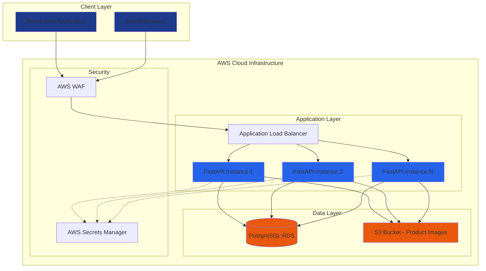
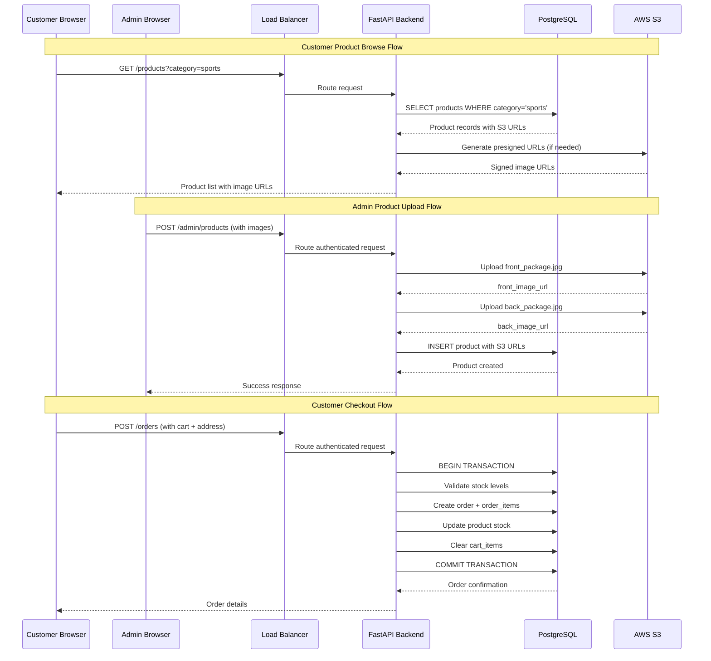
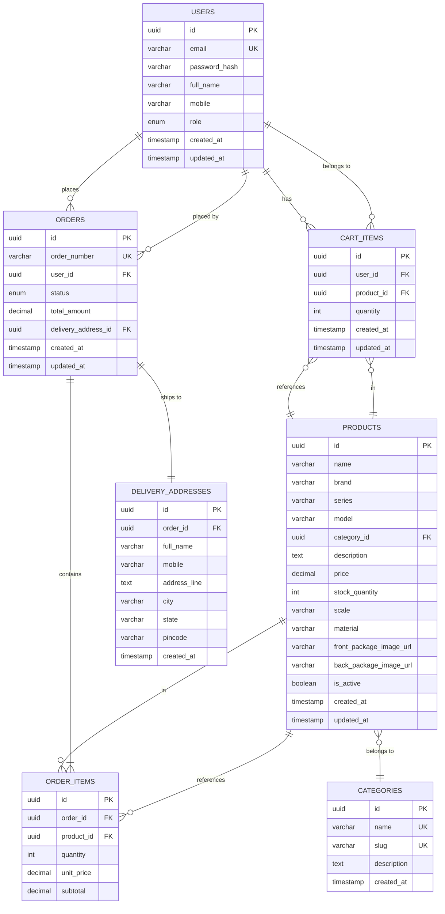
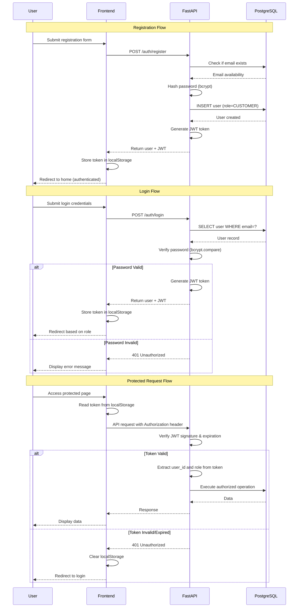
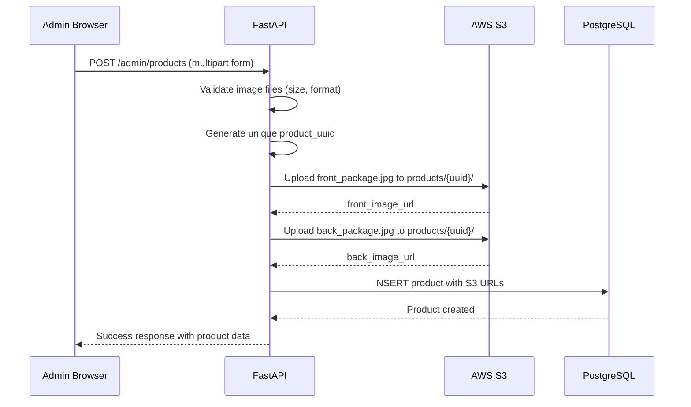
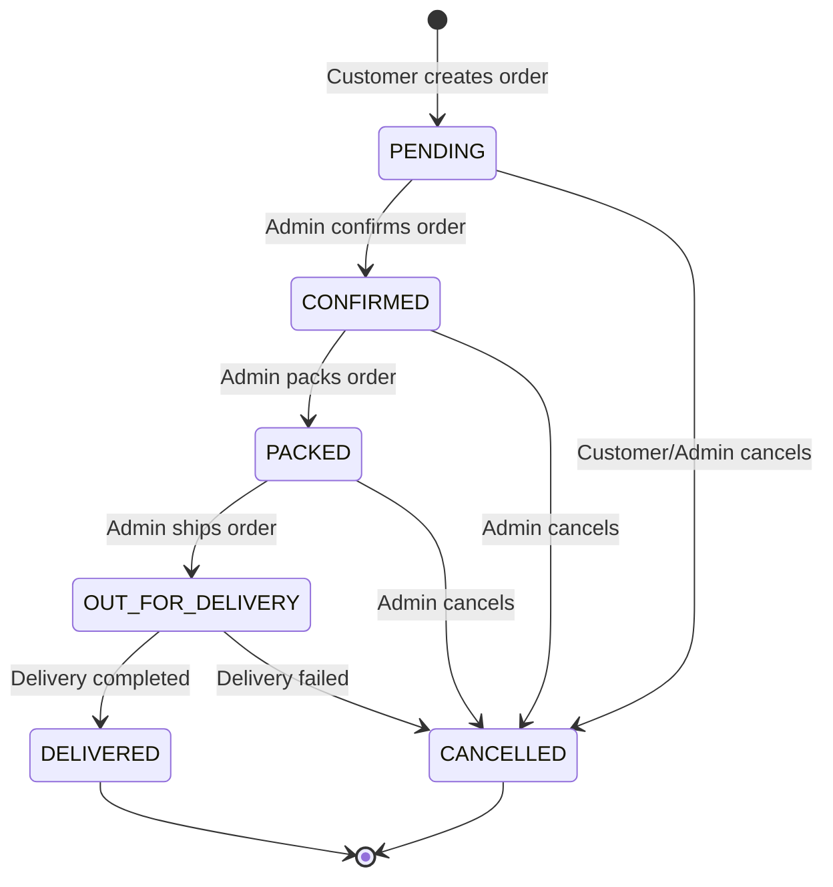
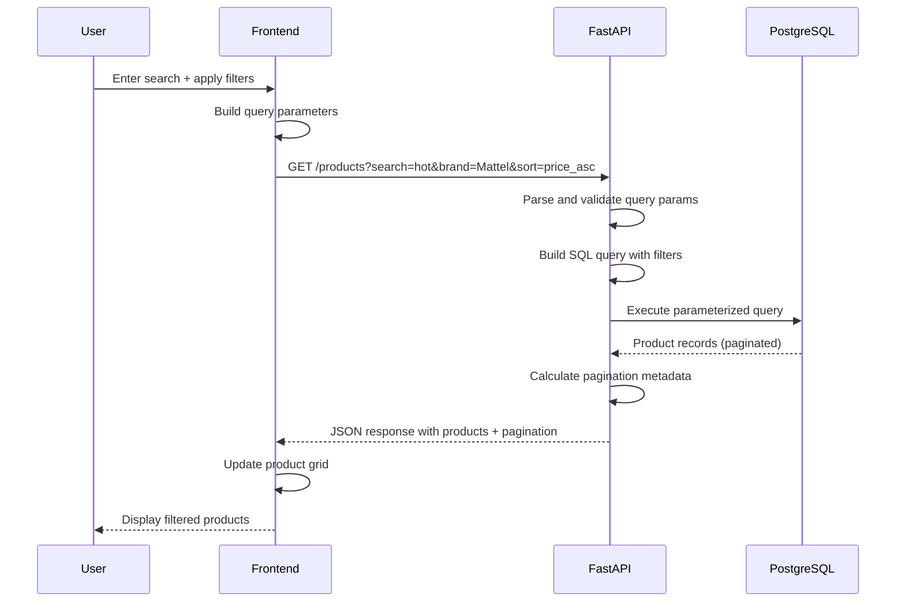

# Design Document: CAR COLLECTORS E-Commerce Platform

## Overview

CAR COLLECTORS is a premium full-stack e-commerce platform for die-cast model car enthusiasts, initially focused on Hot Wheels collectibles. The platform enables customers to browse, search, and purchase die-cast cars while providing administrators with comprehensive tools for product and order management. The system prioritizes a premium automotive racing aesthetic with a distinctive brand identity (Deep Navy/Electric Blue/KTM Orange color scheme) and maintains professional-grade security, scalability, and user experience standards suitable for real-world commercial deployment.

The architecture leverages React for a responsive frontend, Python FastAPI for high-performance backend APIs, PostgreSQL for reliable data persistence, and AWS infrastructure (S3 for image storage, EC2/ECS for hosting) to ensure scalability and production readiness. A critical design constraint is the dual-image product model: each product must display exactly two package images (front and back of the original Hot Wheels card/package), stored in AWS S3 with URLs persisted in the database.

The platform supports two distinct user roles with separate authentication flows: ADMIN users manage the product catalog, inventory, and orders through a dedicated dashboard, while CUSTOMER users browse products, manage shopping carts, complete purchases with delivery information, and track order history. The order lifecycle follows a defined status progression (PENDING → CONFIRMED → PACKED → OUT FOR DELIVERY → DELIVERED, with optional CANCELLED state) that customers can view and administrators can update.

## Architecture



### High-Level Component Interaction



## System Components

### 1. Frontend Layer (React)

**Technology Choice: React 18+ with TypeScript**

**Justification:**
- Component-based architecture enables reusable UI elements (ProductCard, CartItem, OrderStatus)
- Virtual DOM ensures smooth user experience for catalog browsing
- Strong ecosystem for e-commerce (React Router for navigation, Context API or Zustand for state)
- TypeScript adds type safety critical for product data and order management
- Excellent mobile responsiveness with CSS-in-JS or Tailwind CSS

**Key Pages:**
- Public: Home, Product Listing, Product Details, Login/Register, About
- Customer: Profile, Cart, Checkout, Order History, Order Details
- Admin: Dashboard, Product Management (List/Add/Edit), Order Management

**State Management:**
- React Context API or Zustand for global state (authentication, cart, user profile)
- Local component state for UI interactions (modals, form inputs)
- React Query for server state management (products, orders caching)

### 2. Backend Layer (Python FastAPI)

**Technology Choice: FastAPI 0.100+ with Python 3.11+**

**Justification:**
- High performance: Async/await support for concurrent request handling
- Automatic OpenAPI documentation (Swagger UI) for API testing
- Built-in data validation using Pydantic models
- Type hints improve code maintainability
- Excellent async support for database and S3 operations
- Lightweight compared to Django for API-focused application

**Architecture Pattern: Layered Architecture**
- **Router Layer:** Endpoint definitions grouped by domain (auth, products, orders, admin)
- **Service Layer:** Business logic (order processing, stock validation, image upload)
- **Repository Layer:** Database operations abstracted from business logic
- **Model Layer:** SQLAlchemy ORM models and Pydantic schemas

### 3. Database Layer (PostgreSQL)

**Technology Choice: PostgreSQL 15+ on AWS RDS**

**Justification:**
- ACID compliance ensures order transaction integrity
- Rich data types (JSONB for product metadata, Array for categories)
- Strong indexing capabilities for search/filter operations
- Proven reliability for e-commerce workloads
- AWS RDS provides automated backups, multi-AZ deployment, read replicas

### 4. Object Storage (AWS S3)

**Technology Choice: AWS S3 with CloudFront CDN**

**Justification:**
- Scalable storage for product images (no server disk space constraints)
- High availability (99.99% SLA)
- Cost-effective for static asset storage
- CloudFront CDN integration for fast global image delivery
- Presigned URLs for secure admin upload access
- Lifecycle policies for managing placeholder vs. real images

### 5. Cloud Infrastructure (AWS)

**Components:**
- **Compute:** EC2 instances or ECS Fargate for FastAPI containers
- **Load Balancing:** Application Load Balancer for traffic distribution
- **Database:** RDS PostgreSQL with Multi-AZ deployment
- **Storage:** S3 for images, CloudFront for CDN
- **Security:** WAF for API protection, Secrets Manager for credentials
- **Monitoring:** CloudWatch for logs and metrics

## Database Schema



### Detailed Schema Definitions

#### USERS Table
```sql
CREATE TABLE users (
    id UUID PRIMARY KEY DEFAULT gen_random_uuid(),
    email VARCHAR(255) UNIQUE NOT NULL,
    password_hash VARCHAR(255) NOT NULL,
    full_name VARCHAR(255) NOT NULL,
    mobile VARCHAR(20),
    role VARCHAR(20) NOT NULL CHECK (role IN ('ADMIN', 'CUSTOMER')),
    is_active BOOLEAN DEFAULT TRUE,
    created_at TIMESTAMP DEFAULT CURRENT_TIMESTAMP,
    updated_at TIMESTAMP DEFAULT CURRENT_TIMESTAMP
);

CREATE INDEX idx_users_email ON users(email);
CREATE INDEX idx_users_role ON users(role);
```

#### CATEGORIES Table
```sql
CREATE TABLE categories (
    id UUID PRIMARY KEY DEFAULT gen_random_uuid(),
    name VARCHAR(100) UNIQUE NOT NULL,
    slug VARCHAR(100) UNIQUE NOT NULL,
    description TEXT,
    created_at TIMESTAMP DEFAULT CURRENT_TIMESTAMP
);

CREATE INDEX idx_categories_slug ON categories(slug);
```

#### PRODUCTS Table
```sql
CREATE TABLE products (
    id UUID PRIMARY KEY DEFAULT gen_random_uuid(),
    name VARCHAR(255) NOT NULL,
    brand VARCHAR(100) NOT NULL,
    series VARCHAR(100),
    model VARCHAR(100),
    category_id UUID NOT NULL REFERENCES categories(id),
    description TEXT,
    price DECIMAL(10, 2) NOT NULL CHECK (price >= 0),
    stock_quantity INTEGER NOT NULL DEFAULT 0 CHECK (stock_quantity >= 0),
    scale VARCHAR(50),
    material VARCHAR(100),
    front_package_image_url VARCHAR(500) NOT NULL,
    back_package_image_url VARCHAR(500) NOT NULL,
    is_active BOOLEAN DEFAULT TRUE,
    created_at TIMESTAMP DEFAULT CURRENT_TIMESTAMP,
    updated_at TIMESTAMP DEFAULT CURRENT_TIMESTAMP
);

CREATE INDEX idx_products_brand ON products(brand);
CREATE INDEX idx_products_series ON products(series);
CREATE INDEX idx_products_category ON products(category_id);
CREATE INDEX idx_products_price ON products(price);
CREATE INDEX idx_products_is_active ON products(is_active);
CREATE INDEX idx_products_created_at ON products(created_at DESC);
```

#### CART_ITEMS Table
```sql
CREATE TABLE cart_items (
    id UUID PRIMARY KEY DEFAULT gen_random_uuid(),
    user_id UUID NOT NULL REFERENCES users(id) ON DELETE CASCADE,
    product_id UUID NOT NULL REFERENCES products(id) ON DELETE CASCADE,
    quantity INTEGER NOT NULL CHECK (quantity > 0),
    created_at TIMESTAMP DEFAULT CURRENT_TIMESTAMP,
    updated_at TIMESTAMP DEFAULT CURRENT_TIMESTAMP,
    UNIQUE(user_id, product_id)
);

CREATE INDEX idx_cart_items_user ON cart_items(user_id);
```

#### ORDERS Table
```sql
CREATE TABLE orders (
    id UUID PRIMARY KEY DEFAULT gen_random_uuid(),
    order_number VARCHAR(50) UNIQUE NOT NULL,
    user_id UUID NOT NULL REFERENCES users(id),
    status VARCHAR(30) NOT NULL CHECK (status IN ('PENDING', 'CONFIRMED', 'PACKED', 'OUT_FOR_DELIVERY', 'DELIVERED', 'CANCELLED')),
    total_amount DECIMAL(10, 2) NOT NULL CHECK (total_amount >= 0),
    created_at TIMESTAMP DEFAULT CURRENT_TIMESTAMP,
    updated_at TIMESTAMP DEFAULT CURRENT_TIMESTAMP
);

CREATE INDEX idx_orders_user ON orders(user_id);
CREATE INDEX idx_orders_status ON orders(status);
CREATE INDEX idx_orders_created_at ON orders(created_at DESC);
CREATE INDEX idx_orders_order_number ON orders(order_number);
```

#### ORDER_ITEMS Table
```sql
CREATE TABLE order_items (
    id UUID PRIMARY KEY DEFAULT gen_random_uuid(),
    order_id UUID NOT NULL REFERENCES orders(id) ON DELETE CASCADE,
    product_id UUID NOT NULL REFERENCES products(id),
    quantity INTEGER NOT NULL CHECK (quantity > 0),
    unit_price DECIMAL(10, 2) NOT NULL CHECK (unit_price >= 0),
    subtotal DECIMAL(10, 2) NOT NULL CHECK (subtotal >= 0)
);

CREATE INDEX idx_order_items_order ON order_items(order_id);
```

#### DELIVERY_ADDRESSES Table
```sql
CREATE TABLE delivery_addresses (
    id UUID PRIMARY KEY DEFAULT gen_random_uuid(),
    order_id UUID NOT NULL REFERENCES orders(id) ON DELETE CASCADE,
    full_name VARCHAR(255) NOT NULL,
    mobile VARCHAR(20) NOT NULL,
    address_line TEXT NOT NULL,
    city VARCHAR(100) NOT NULL,
    state VARCHAR(100) NOT NULL,
    pincode VARCHAR(10) NOT NULL,
    created_at TIMESTAMP DEFAULT CURRENT_TIMESTAMP
);

CREATE INDEX idx_delivery_addresses_order ON delivery_addresses(order_id);
```

## API Structure

### Base URL Structure
- Production: `https://api.carcollectors.com/v1`
- Development: `http://localhost:8000/v1`

### Authentication

All authenticated endpoints require JWT token in Authorization header:
```
Authorization: Bearer <jwt_token>
```

### API Endpoints

#### 1. Authentication Endpoints

**POST /auth/register**
- **Purpose:** Customer registration
- **Auth Required:** No
- **Request Body:**
```typescript
{
  email: string;
  password: string;
  full_name: string;
  mobile?: string;
}
```
- **Response:** 201 Created
```typescript
{
  id: string;
  email: string;
  full_name: string;
  role: "CUSTOMER";
  access_token: string;
  token_type: "bearer";
}
```

**POST /auth/login**
- **Purpose:** Customer/Admin login
- **Auth Required:** No
- **Request Body:**
```typescript
{
  email: string;
  password: string;
}
```
- **Response:** 200 OK
```typescript
{
  access_token: string;
  token_type: "bearer";
  user: {
    id: string;
    email: string;
    full_name: string;
    role: "ADMIN" | "CUSTOMER";
  }
}
```

**POST /auth/logout**
- **Purpose:** Invalidate token (optional, client-side token removal)
- **Auth Required:** Yes
- **Response:** 200 OK

**GET /auth/me**
- **Purpose:** Get current user profile
- **Auth Required:** Yes
- **Response:** 200 OK
```typescript
{
  id: string;
  email: string;
  full_name: string;
  mobile?: string;
  role: "ADMIN" | "CUSTOMER";
}
```

#### 2. Product Endpoints (Public)

**GET /products**
- **Purpose:** List products with filters/search
- **Auth Required:** No
- **Query Parameters:**
  - `page` (default: 1)
  - `limit` (default: 20, max: 100)
  - `search` (searches name, brand, series, model)
  - `brand` (filter by brand)
  - `series` (filter by series)
  - `category` (filter by category slug)
  - `min_price` (minimum price filter)
  - `max_price` (maximum price filter)
  - `in_stock` (boolean, filter available items)
  - `sort_by` (options: price_asc, price_desc, name_asc, name_desc, newest, oldest)
- **Response:** 200 OK
```typescript
{
  products: Array<{
    id: string;
    name: string;
    brand: string;
    series: string;
    model: string;
    category: { id: string; name: string; slug: string };
    price: number;
    stock_quantity: number;
    front_package_image_url: string;
    back_package_image_url: string;
    scale: string;
    material: string;
  }>;
  pagination: {
    page: number;
    limit: number;
    total: number;
    total_pages: number;
  }
}
```

**GET /products/:id**
- **Purpose:** Get single product details
- **Auth Required:** No
- **Response:** 200 OK (same product structure as above with full description)

**GET /categories**
- **Purpose:** List all categories
- **Auth Required:** No
- **Response:** 200 OK
```typescript
{
  categories: Array<{
    id: string;
    name: string;
    slug: string;
    description: string;
    product_count: number;
  }>
}
```

#### 3. Cart Endpoints (Customer Only)

**GET /cart**
- **Purpose:** Get current user's cart
- **Auth Required:** Yes (CUSTOMER)
- **Response:** 200 OK
```typescript
{
  items: Array<{
    id: string;
    product: {
      id: string;
      name: string;
      brand: string;
      price: number;
      stock_quantity: number;
      front_package_image_url: string;
    };
    quantity: number;
    subtotal: number;
  }>;
  total: number;
}
```

**POST /cart/items**
- **Purpose:** Add item to cart
- **Auth Required:** Yes (CUSTOMER)
- **Request Body:**
```typescript
{
  product_id: string;
  quantity: number;
}
```
- **Response:** 201 Created (returns updated cart)

**PATCH /cart/items/:id**
- **Purpose:** Update cart item quantity
- **Auth Required:** Yes (CUSTOMER)
- **Request Body:**
```typescript
{
  quantity: number;
}
```
- **Response:** 200 OK (returns updated cart)

**DELETE /cart/items/:id**
- **Purpose:** Remove item from cart
- **Auth Required:** Yes (CUSTOMER)
- **Response:** 200 OK (returns updated cart)

**DELETE /cart**
- **Purpose:** Clear entire cart
- **Auth Required:** Yes (CUSTOMER)
- **Response:** 200 OK

#### 4. Order Endpoints (Customer)

**POST /orders**
- **Purpose:** Create order from cart
- **Auth Required:** Yes (CUSTOMER)
- **Request Body:**
```typescript
{
  delivery_address: {
    full_name: string;
    mobile: string;
    address_line: string;
    city: string;
    state: string;
    pincode: string;
  }
}
```
- **Response:** 201 Created
```typescript
{
  id: string;
  order_number: string;
  status: "PENDING";
  total_amount: number;
  items: Array<{
    product: { id: string; name: string; brand: string };
    quantity: number;
    unit_price: number;
    subtotal: number;
  }>;
  delivery_address: { ... };
  created_at: string;
}
```

**GET /orders**
- **Purpose:** Get customer's order history
- **Auth Required:** Yes (CUSTOMER)
- **Query Parameters:**
  - `page` (default: 1)
  - `limit` (default: 10)
  - `status` (filter by status)
- **Response:** 200 OK (paginated order list)

**GET /orders/:id**
- **Purpose:** Get single order details
- **Auth Required:** Yes (CUSTOMER - own orders only)
- **Response:** 200 OK (full order details)

#### 5. Admin - Product Management

**POST /admin/products**
- **Purpose:** Create new product
- **Auth Required:** Yes (ADMIN)
- **Request Body:** Multipart form-data
  - `name` (string)
  - `brand` (string)
  - `series` (string, optional)
  - `model` (string, optional)
  - `category_id` (string)
  - `description` (string, optional)
  - `price` (decimal)
  - `stock_quantity` (integer)
  - `scale` (string, optional)
  - `material` (string, optional)
  - `front_package_image` (file)
  - `back_package_image` (file)
- **Response:** 201 Created (product object)

**PATCH /admin/products/:id**
- **Purpose:** Update product
- **Auth Required:** Yes (ADMIN)
- **Request Body:** Multipart form-data (all fields optional, including image updates)
- **Response:** 200 OK (updated product object)

**DELETE /admin/products/:id**
- **Purpose:** Soft delete product (set is_active = false)
- **Auth Required:** Yes (ADMIN)
- **Response:** 200 OK

**GET /admin/products**
- **Purpose:** Admin product listing with all products (including inactive)
- **Auth Required:** Yes (ADMIN)
- **Query Parameters:** Same as public GET /products
- **Response:** 200 OK (includes is_active field)

#### 6. Admin - Order Management

**GET /admin/orders**
- **Purpose:** List all orders
- **Auth Required:** Yes (ADMIN)
- **Query Parameters:**
  - `page`, `limit`
  - `status` (filter)
  - `date_from`, `date_to` (date range)
  - `search` (order number, customer name)
- **Response:** 200 OK (paginated order list with customer info)

**GET /admin/orders/:id**
- **Purpose:** Get order details
- **Auth Required:** Yes (ADMIN)
- **Response:** 200 OK (full order with customer and delivery info)

**PATCH /admin/orders/:id/status**
- **Purpose:** Update order status
- **Auth Required:** Yes (ADMIN)
- **Request Body:**
```typescript
{
  status: "PENDING" | "CONFIRMED" | "PACKED" | "OUT_FOR_DELIVERY" | "DELIVERED" | "CANCELLED";
}
```
- **Response:** 200 OK (updated order)

#### 7. Admin - Dashboard

**GET /admin/dashboard/stats**
- **Purpose:** Get dashboard statistics
- **Auth Required:** Yes (ADMIN)
- **Response:** 200 OK
```typescript
{
  total_products: number;
  total_stock: number;
  orders_by_status: {
    PENDING: number;
    CONFIRMED: number;
    PACKED: number;
    OUT_FOR_DELIVERY: number;
    DELIVERED: number;
    CANCELLED: number;
  };
  revenue: {
    total: number;
    this_month: number;
    this_week: number;
  };
  recent_orders: Array<OrderSummary>;
}
```

### Error Response Format

All errors follow consistent structure:
```typescript
{
  error: {
    code: string;  // e.g., "INVALID_INPUT", "UNAUTHORIZED", "NOT_FOUND"
    message: string;  // Human-readable error message
    details?: any;  // Optional validation details
  }
}
```

**HTTP Status Codes:**
- 200: Success
- 201: Created
- 400: Bad Request (validation errors)
- 401: Unauthorized (missing/invalid token)
- 403: Forbidden (insufficient permissions)
- 404: Not Found
- 409: Conflict (e.g., email already exists)
- 500: Internal Server Error

## Frontend Architecture

### Technology Stack
- **Framework:** React 18+ with TypeScript
- **Routing:** React Router v6
- **State Management:** Zustand (lightweight alternative to Redux)
- **HTTP Client:** Axios with interceptors
- **Styling:** Tailwind CSS with custom CAR COLLECTORS theme
- **Forms:** React Hook Form with Zod validation
- **Image Handling:** React Lazy Load Images
- **Build Tool:** Vite

### Project Structure
```
frontend/
├── public/
│   ├── favicon.ico
│   └── placeholder-car.png
├── src/
│   ├── api/
│   │   ├── axios.config.ts
│   │   ├── auth.api.ts
│   │   ├── products.api.ts
│   │   ├── cart.api.ts
│   │   ├── orders.api.ts
│   │   └── admin.api.ts
│   ├── components/
│   │   ├── common/
│   │   │   ├── Button.tsx
│   │   │   ├── Input.tsx
│   │   │   ├── Modal.tsx
│   │   │   ├── LoadingSpinner.tsx
│   │   │   └── ErrorBoundary.tsx
│   │   ├── layout/
│   │   │   ├── Header.tsx
│   │   │   ├── Footer.tsx
│   │   │   ├── Navigation.tsx
│   │   │   └── AdminSidebar.tsx
│   │   ├── products/
│   │   │   ├── ProductCard.tsx
│   │   │   ├── ProductGrid.tsx
│   │   │   ├── ProductFilters.tsx
│   │   │   ├── ProductSearch.tsx
│   │   │   └── ImageToggle.tsx
│   │   ├── cart/
│   │   │   ├── CartItem.tsx
│   │   │   ├── CartSummary.tsx
│   │   │   └── CartIcon.tsx
│   │   └── orders/
│   │       ├── OrderCard.tsx
│   │       ├── OrderStatusBadge.tsx
│   │       └── DeliveryAddressForm.tsx
│   ├── pages/
│   │   ├── public/
│   │   │   ├── HomePage.tsx
│   │   │   ├── ProductListingPage.tsx
│   │   │   ├── ProductDetailsPage.tsx
│   │   │   ├── LoginPage.tsx
│   │   │   └── RegisterPage.tsx
│   │   ├── customer/
│   │   │   ├── CartPage.tsx
│   │   │   ├── CheckoutPage.tsx
│   │   │   ├── OrderHistoryPage.tsx
│   │   │   ├── OrderDetailsPage.tsx
│   │   │   └── ProfilePage.tsx
│   │   └── admin/
│   │       ├── DashboardPage.tsx
│   │       ├── ProductListPage.tsx
│   │       ├── ProductFormPage.tsx
│   │       └── OrderManagementPage.tsx
│   ├── store/
│   │   ├── authStore.ts
│   │   ├── cartStore.ts
│   │   └── uiStore.ts
│   ├── types/
│   │   ├── user.types.ts
│   │   ├── product.types.ts
│   │   ├── cart.types.ts
│   │   └── order.types.ts
│   ├── utils/
│   │   ├── formatters.ts
│   │   ├── validators.ts
│   │   └── constants.ts
│   ├── hooks/
│   │   ├── useAuth.ts
│   │   ├── useCart.ts
│   │   └── useProducts.ts
│   ├── routes/
│   │   ├── AppRoutes.tsx
│   │   ├── ProtectedRoute.tsx
│   │   └── AdminRoute.tsx
│   ├── App.tsx
│   ├── main.tsx
│   └── theme.config.ts
├── package.json
├── tsconfig.json
├── tailwind.config.js
└── vite.config.ts
```

### Routing Structure

```typescript
// routes/AppRoutes.tsx
import { Routes, Route } from 'react-router-dom';

export function AppRoutes() {
  return (
    <Routes>
      {/* Public Routes */}
      <Route path="/" element={<HomePage />} />
      <Route path="/products" element={<ProductListingPage />} />
      <Route path="/products/:id" element={<ProductDetailsPage />} />
      <Route path="/login" element={<LoginPage />} />
      <Route path="/register" element={<RegisterPage />} />
      
      {/* Customer Protected Routes */}
      <Route element={<ProtectedRoute role="CUSTOMER" />}>
        <Route path="/cart" element={<CartPage />} />
        <Route path="/checkout" element={<CheckoutPage />} />
        <Route path="/orders" element={<OrderHistoryPage />} />
        <Route path="/orders/:id" element={<OrderDetailsPage />} />
        <Route path="/profile" element={<ProfilePage />} />
      </Route>
      
      {/* Admin Protected Routes */}
      <Route element={<AdminRoute />}>
        <Route path="/admin/dashboard" element={<DashboardPage />} />
        <Route path="/admin/products" element={<ProductListPage />} />
        <Route path="/admin/products/new" element={<ProductFormPage />} />
        <Route path="/admin/products/:id/edit" element={<ProductFormPage />} />
        <Route path="/admin/orders" element={<OrderManagementPage />} />
      </Route>
      
      {/* 404 */}
      <Route path="*" element={<NotFoundPage />} />
    </Routes>
  );
}
```

### State Management with Zustand

```typescript
// store/authStore.ts
interface AuthState {
  user: User | null;
  token: string | null;
  isAuthenticated: boolean;
  login: (email: string, password: string) => Promise<void>;
  logout: () => void;
  register: (data: RegisterData) => Promise<void>;
}

export const useAuthStore = create<AuthState>((set) => ({
  user: null,
  token: localStorage.getItem('token'),
  isAuthenticated: false,
  login: async (email, password) => {
    const response = await authApi.login(email, password);
    localStorage.setItem('token', response.access_token);
    set({ user: response.user, token: response.access_token, isAuthenticated: true });
  },
  logout: () => {
    localStorage.removeItem('token');
    set({ user: null, token: null, isAuthenticated: false });
  },
  register: async (data) => {
    const response = await authApi.register(data);
    localStorage.setItem('token', response.access_token);
    set({ user: response, token: response.access_token, isAuthenticated: true });
  },
}));

// store/cartStore.ts
interface CartState {
  items: CartItem[];
  total: number;
  fetchCart: () => Promise<void>;
  addItem: (productId: string, quantity: number) => Promise<void>;
  updateQuantity: (itemId: string, quantity: number) => Promise<void>;
  removeItem: (itemId: string) => Promise<void>;
  clearCart: () => Promise<void>;
}
```

### Component Design Patterns

#### ProductCard Component (Critical Design)

```typescript
// components/products/ProductCard.tsx
interface ProductCardProps {
  product: {
    id: string;
    name: string;
    brand: string;
    series: string;
    price: number;
    stock_quantity: number;
    front_package_image_url: string;
  };
  onAddToCart: (productId: string) => void;
}

export function ProductCard({ product, onAddToCart }: ProductCardProps) {
  return (
    <div className="bg-navy-900 rounded-lg overflow-hidden border border-blue-600 hover:border-orange-500 transition-all shadow-lg hover:shadow-xl">
      {/* Image Section */}
      <div className="relative aspect-square bg-navy-800">
        
        {product.stock_quantity === 0 && (
          <div className="absolute inset-0 bg-black/60 flex items-center justify-center">
            <span className="text-white font-bold">OUT OF STOCK</span>
          </div>
        )}
      </div>
      
      {/* Info Section */}
      <div className="p-4 space-y-2">
        <h3 className="text-white font-bold text-lg truncate">{product.name}</h3>
        <p className="text-blue-400 text-sm">{product.brand} • {product.series}</p>
        
        {/* Price and CTA */}
        <div className="flex items-center justify-between pt-2">
          <span className="text-orange-500 font-bold text-xl">₹{product.price}</span>
          <button
            onClick={() => onAddToCart(product.id)}
            disabled={product.stock_quantity === 0}
            className="bg-orange-500 hover:bg-orange-600 text-white px-4 py-2 rounded font-semibold disabled:bg-gray-600 disabled:cursor-not-allowed transition"
          >
            Add to Cart
          </button>
        </div>
        
        {/* Stock Indicator */}
        <p className="text-gray-400 text-xs">
          {product.stock_quantity > 0 ? `${product.stock_quantity} in stock` : 'Out of stock'}
        </p>
      </div>
    </div>
  );
}
```

#### Image Toggle Component (Product Details)

```typescript
// components/products/ImageToggle.tsx
interface ImageToggleProps {
  frontImageUrl: string;
  backImageUrl: string;
  productName: string;
}

export function ImageToggle({ frontImageUrl, backImageUrl, productName }: ImageToggleProps) {
  const [showFront, setShowFront] = useState(true);
  
  return (
    <div className="space-y-4">
      {/* Main Image Display */}
      <div className="aspect-square bg-navy-800 rounded-lg overflow-hidden">
        
      </div>
      
      {/* Toggle Buttons */}
      <div className="flex gap-2">
        <button
          onClick={() => setShowFront(true)}
          className={`flex-1 py-2 px-4 rounded font-semibold transition ${
            showFront
              ? 'bg-blue-600 text-white'
              : 'bg-navy-800 text-gray-400 hover:bg-navy-700'
          }`}
        >
          Front Package
        </button>
        <button
          onClick={() => setShowFront(false)}
          className={`flex-1 py-2 px-4 rounded font-semibold transition ${
            !showFront
              ? 'bg-blue-600 text-white'
              : 'bg-navy-800 text-gray-400 hover:bg-navy-700'
          }`}
        >
          Back Package
        </button>
      </div>
      
      {/* Thumbnail Preview */}
      <div className="flex gap-2">
        <div
          onClick={() => setShowFront(true)}
          className={`w-20 h-20 rounded cursor-pointer border-2 ${
            showFront ? 'border-blue-600' : 'border-transparent'
          }`}
        >
          
        </div>
        <div
          onClick={() => setShowFront(false)}
          className={`w-20 h-20 rounded cursor-pointer border-2 ${
            !showFront ? 'border-blue-600' : 'border-transparent'
          }`}
        >
          
        </div>
      </div>
    </div>
  );
}
```

### Tailwind Theme Configuration

```javascript
// tailwind.config.js
module.exports = {
  content: ['./src/**/*.{js,jsx,ts,tsx}'],
  theme: {
    extend: {
      colors: {
        navy: {
          900: '#0f172a',  // Deep Navy - primary background
          800: '#1e293b',  // Lighter navy for cards
          700: '#334155',  // Borders and dividers
        },
        blue: {
          600: '#2563eb',  // Electric Blue - primary actions
          500: '#3b82f6',  // Hover states
          400: '#60a5fa',  // Secondary text
        },
        orange: {
          500: '#ea580c',  // KTM Orange - accent (price, CTA)
          600: '#c2410c',  // Hover state
        }
      },
      fontFamily: {
        sans: ['Inter', 'system-ui', 'sans-serif'],
        display: ['Rajdhani', 'sans-serif'],  // Racing-style headers
      },
    },
  },
  plugins: [],
};
```

### Responsive Design Strategy

**Breakpoints:**
- Mobile: < 640px
- Tablet: 640px - 1024px
- Desktop: > 1024px

**Product Grid Responsive:**
```css
/* Mobile: 1 column */
.product-grid { grid-template-columns: repeat(1, minmax(0, 1fr)); }

/* Tablet: 2 columns */
@media (min-width: 640px) {
  .product-grid { grid-template-columns: repeat(2, minmax(0, 1fr)); }
}

/* Desktop: 3-4 columns */
@media (min-width: 1024px) {
  .product-grid { grid-template-columns: repeat(4, minmax(0, 1fr)); }
}
```

**Mobile Navigation:**
- Hamburger menu for mobile
- Full horizontal navigation for desktop
- Sticky cart icon in mobile header

## Authentication & Authorization

### Authentication Flow



### JWT Token Structure

**Token Payload:**
```json
{
  "sub": "user_uuid",
  "email": "user@example.com",
  "role": "CUSTOMER",
  "iat": 1234567890,
  "exp": 1234571490
}
```

**Token Configuration:**
- Algorithm: HS256
- Expiration: 7 days
- Secret: Stored in AWS Secrets Manager
- Refresh: Not implemented in MVP (re-login required after expiration)

### Password Security

**Hashing Strategy:**
- Algorithm: bcrypt
- Cost Factor: 12 (2^12 iterations)
- Salt: Automatically generated per password

```python
# Backend implementation (FastAPI)
from passlib.context import CryptContext

pwd_context = CryptContext(schemes=["bcrypt"], deprecated="auto")

def hash_password(password: str) -> str:
    return pwd_context.hash(password)

def verify_password(plain_password: str, hashed_password: str) -> bool:
    return pwd_context.verify(plain_password, hashed_password)
```

### Authorization Middleware

```python
# Backend: auth/dependencies.py
from fastapi import Depends, HTTPException, status
from fastapi.security import HTTPBearer, HTTPAuthorizationCredentials
from jose import JWTError, jwt

security = HTTPBearer()

async def get_current_user(
    credentials: HTTPAuthorizationCredentials = Depends(security)
) -> User:
    """Validate JWT and return current user."""
    token = credentials.credentials
    try:
        payload = jwt.decode(token, SECRET_KEY, algorithms=["HS256"])
        user_id: str = payload.get("sub")
        if user_id is None:
            raise HTTPException(status_code=401, detail="Invalid token")
    except JWTError:
        raise HTTPException(status_code=401, detail="Invalid token")
    
    user = await get_user_by_id(user_id)
    if user is None:
        raise HTTPException(status_code=401, detail="User not found")
    return user

async def require_admin(
    current_user: User = Depends(get_current_user)
) -> User:
    """Require ADMIN role."""
    if current_user.role != "ADMIN":
        raise HTTPException(status_code=403, detail="Admin access required")
    return current_user

async def require_customer(
    current_user: User = Depends(get_current_user)
) -> User:
    """Require CUSTOMER role."""
    if current_user.role != "CUSTOMER":
        raise HTTPException(status_code=403, detail="Customer access required")
    return current_user
```

### Frontend Auth Protection

```typescript
// routes/ProtectedRoute.tsx
interface ProtectedRouteProps {
  role: 'ADMIN' | 'CUSTOMER';
}

export function ProtectedRoute({ role }: ProtectedRouteProps) {
  const { user, isAuthenticated } = useAuthStore();
  
  if (!isAuthenticated) {
    return <Navigate to="/login" replace />;
  }
  
  if (user?.role !== role) {
    return <Navigate to="/" replace />;
  }
  
  return <Outlet />;
}

// API Axios Configuration with Interceptor
axios.interceptors.request.use((config) => {
  const token = localStorage.getItem('token');
  if (token) {
    config.headers.Authorization = `Bearer ${token}`;
  }
  return config;
});

axios.interceptors.response.use(
  (response) => response,
  (error) => {
    if (error.response?.status === 401) {
      localStorage.removeItem('token');
      window.location.href = '/login';
    }
    return Promise.reject(error);
  }
);
```

## Image Storage Architecture (AWS S3)

### S3 Bucket Structure

```
car-collectors-images/
├── products/
│   ├── {product_uuid}/
│   │   ├── front_package.jpg
│   │   └── back_package.jpg
├── placeholders/
│   ├── front_placeholder.png
│   └── back_placeholder.png
```

### Image Upload Flow



### Backend S3 Integration

```python
# services/s3_service.py
import boto3
from uuid import UUID
from fastapi import UploadFile

class S3Service:
    def __init__(self):
        self.s3_client = boto3.client(
            's3',
            aws_access_key_id=settings.AWS_ACCESS_KEY_ID,
            aws_secret_access_key=settings.AWS_SECRET_ACCESS_KEY,
            region_name=settings.AWS_REGION
        )
        self.bucket_name = settings.S3_BUCKET_NAME
        self.cloudfront_domain = settings.CLOUDFRONT_DOMAIN
    
    async def upload_product_image(
        self,
        product_id: UUID,
        image_file: UploadFile,
        image_type: str  # 'front' or 'back'
    ) -> str:
        """Upload product image to S3 and return CloudFront URL."""
        # Validate file
        if image_file.content_type not in ['image/jpeg', 'image/png', 'image/webp']:
            raise ValueError("Invalid image format")
        
        # Generate S3 key
        file_extension = image_file.filename.split('.')[-1]
        s3_key = f"products/{product_id}/{image_type}_package.{file_extension}"
        
        # Upload to S3
        await self.s3_client.upload_fileobj(
            image_file.file,
            self.bucket_name,
            s3_key,
            ExtraArgs={
                'ContentType': image_file.content_type,
                'CacheControl': 'max-age=31536000',  # 1 year cache
            }
        )
        
        # Return CloudFront URL
        return f"https://{self.cloudfront_domain}/{s3_key}"
    
    async def delete_product_images(self, product_id: UUID):
        """Delete all images for a product."""
        prefix = f"products/{product_id}/"
        response = self.s3_client.list_objects_v2(
            Bucket=self.bucket_name,
            Prefix=prefix
        )
        
        if 'Contents' in response:
            objects = [{'Key': obj['Key']} for obj in response['Contents']]
            self.s3_client.delete_objects(
                Bucket=self.bucket_name,
                Delete={'Objects': objects}
            )
```

### Image Validation

**File Size Limits:**
- Maximum: 5MB per image
- Recommended: 1-2MB (optimized for web)

**Allowed Formats:**
- JPEG (.jpg, .jpeg)
- PNG (.png)
- WebP (.webp)

**Dimensions:**
- Minimum: 500x500px
- Recommended: 1000x1000px (square aspect ratio)

### Placeholder Images

**Strategy:**
- Store default placeholder images in S3 `placeholders/` folder
- When admin creates product without images initially, use placeholder URLs
- Admin can upload real images later via product edit

```python
# Default placeholder URLs
PLACEHOLDER_FRONT = f"https://{CLOUDFRONT_DOMAIN}/placeholders/front_placeholder.png"
PLACEHOLDER_BACK = f"https://{CLOUDFRONT_DOMAIN}/placeholders/back_placeholder.png"
```

### CDN Configuration (CloudFront)

**Settings:**
- Origin: S3 bucket
- Cache Behavior: Cache based on query strings
- Allowed Methods: GET, HEAD, OPTIONS
- Price Class: Use Only U.S., Canada and Europe (cost optimization)
- Compress Objects: Yes (automatic Gzip/Brotli)
- TTL: 1 year (images are immutable - change URL to update)

## Order Workflow

### Order Status State Machine



### Order Creation Algorithm

```python
# services/order_service.py
from sqlalchemy.orm import Session
from uuid import uuid4
from datetime import datetime

async def create_order(
    db: Session,
    user_id: str,
    delivery_address: DeliveryAddressSchema
) -> Order:
    """
    Create order from user's cart with atomic transaction.
    
    Preconditions:
    - user_id exists in users table
    - user has items in cart_items table
    - all cart products have sufficient stock
    - delivery_address contains all required fields
    
    Postconditions:
    - Order created with status PENDING
    - OrderItems created for all cart items
    - DeliveryAddress created and linked to order
    - Product stock_quantity decremented by ordered quantities
    - Cart items deleted for user
    - Returns complete Order object with items and address
    
    Loop Invariants:
    - All processed cart items have valid stock
    - Running total matches sum of processed item subtotals
    """
    try:
        # Begin transaction
        db.begin()
        
        # Step 1: Fetch user's cart items with product details
        cart_items = db.query(CartItem).filter(
            CartItem.user_id == user_id
        ).join(Product).all()
        
        if not cart_items:
            raise ValueError("Cart is empty")
        
        # Step 2: Validate stock availability for all items
        for cart_item in cart_items:
            product = cart_item.product
            if product.stock_quantity < cart_item.quantity:
                raise ValueError(
                    f"Insufficient stock for {product.name}. "
                    f"Available: {product.stock_quantity}, Requested: {cart_item.quantity}"
                )
            if not product.is_active:
                raise ValueError(f"Product {product.name} is no longer available")
        
        # Step 3: Generate order number
        order_number = generate_order_number()  # e.g., "CC20240109001"
        
        # Step 4: Calculate total amount
        total_amount = sum(
            item.product.price * item.quantity 
            for item in cart_items
        )
        
        # Step 5: Create order record
        order = Order(
            id=uuid4(),
            order_number=order_number,
            user_id=user_id,
            status="PENDING",
            total_amount=total_amount,
            created_at=datetime.utcnow(),
            updated_at=datetime.utcnow()
        )
        db.add(order)
        db.flush()  # Get order.id without committing
        
        # Step 6: Create delivery address
        address = DeliveryAddress(
            id=uuid4(),
            order_id=order.id,
            full_name=delivery_address.full_name,
            mobile=delivery_address.mobile,
            address_line=delivery_address.address_line,
            city=delivery_address.city,
            state=delivery_address.state,
            pincode=delivery_address.pincode,
            created_at=datetime.utcnow()
        )
        db.add(address)
        
        # Step 7: Create order items and update stock
        for cart_item in cart_items:
            # Create order item
            order_item = OrderItem(
                id=uuid4(),
                order_id=order.id,
                product_id=cart_item.product_id,
                quantity=cart_item.quantity,
                unit_price=cart_item.product.price,
                subtotal=cart_item.product.price * cart_item.quantity
            )
            db.add(order_item)
            
            # Decrement product stock
            cart_item.product.stock_quantity -= cart_item.quantity
        
        # Step 8: Clear user's cart
        db.query(CartItem).filter(
            CartItem.user_id == user_id
        ).delete()
        
        # Commit transaction
        db.commit()
        
        # Step 9: Refresh and return complete order
        db.refresh(order)
        return order
        
    except Exception as e:
        db.rollback()
        raise e
```

### Order Number Generation

```python
def generate_order_number() -> str:
    """
    Generate unique order number.
    Format: CC{YYYYMMDD}{sequential_number}
    Example: CC20240109001
    
    Preconditions: None
    
    Postconditions:
    - Returns unique order number string
    - Format matches CC{date}{sequence}
    """
    from datetime import datetime
    
    today = datetime.utcnow().strftime("%Y%m%d")
    prefix = f"CC{today}"
    
    # Get latest order number for today
    latest_order = db.query(Order).filter(
        Order.order_number.like(f"{prefix}%")
    ).order_by(Order.order_number.desc()).first()
    
    if latest_order:
        # Extract sequence number and increment
        last_sequence = int(latest_order.order_number[-3:])
        new_sequence = last_sequence + 1
    else:
        new_sequence = 1
    
    return f"{prefix}{new_sequence:03d}"
```

### Order Status Update Algorithm

```python
async def update_order_status(
    db: Session,
    order_id: str,
    new_status: str,
    admin_user: User
) -> Order:
    """
    Update order status with validation.
    
    Preconditions:
    - order_id exists in orders table
    - admin_user.role == 'ADMIN'
    - new_status in allowed transitions from current status
    
    Postconditions:
    - Order status updated to new_status
    - Order updated_at timestamp refreshed
    - If status is CANCELLED, product stock restored
    
    State Transitions:
    - PENDING -> {CONFIRMED, CANCELLED}
    - CONFIRMED -> {PACKED, CANCELLED}
    - PACKED -> {OUT_FOR_DELIVERY, CANCELLED}
    - OUT_FOR_DELIVERY -> {DELIVERED, CANCELLED}
    """
    # Fetch order
    order = db.query(Order).filter(Order.id == order_id).first()
    if not order:
        raise ValueError("Order not found")
    
    # Define allowed transitions
    allowed_transitions = {
        "PENDING": ["CONFIRMED", "CANCELLED"],
        "CONFIRMED": ["PACKED", "CANCELLED"],
        "PACKED": ["OUT_FOR_DELIVERY", "CANCELLED"],
        "OUT_FOR_DELIVERY": ["DELIVERED", "CANCELLED"]
    }
    
    # Validate transition
    current_status = order.status
    if new_status not in allowed_transitions.get(current_status, []):
        raise ValueError(
            f"Invalid status transition: {current_status} -> {new_status}"
        )
    
    # Handle cancellation (restore stock)
    if new_status == "CANCELLED":
        for order_item in order.order_items:
            product = order_item.product
            product.stock_quantity += order_item.quantity
    
    # Update status
    order.status = new_status
    order.updated_at = datetime.utcnow()
    db.commit()
    db.refresh(order)
    
    return order
```

## Low-Level Design: Key Algorithms and Functions

### Main Algorithm/Workflow: Product Search and Filtering



### Core Interfaces/Types

```typescript
// TypeScript Frontend Types

interface User {
  id: string;
  email: string;
  full_name: string;
  mobile?: string;
  role: 'ADMIN' | 'CUSTOMER';
  created_at: string;
}

interface Product {
  id: string;
  name: string;
  brand: string;
  series: string;
  model: string;
  category: Category;
  description: string;
  price: number;
  stock_quantity: number;
  scale: string;
  material: string;
  front_package_image_url: string;
  back_package_image_url: string;
  is_active: boolean;
  created_at: string;
  updated_at: string;
}

interface Category {
  id: string;
  name: string;
  slug: string;
  description: string;
}

interface CartItem {
  id: string;
  product: Product;
  quantity: number;
  subtotal: number;
}

interface Cart {
  items: CartItem[];
  total: number;
}

interface DeliveryAddress {
  full_name: string;
  mobile: string;
  address_line: string;
  city: string;
  state: string;
  pincode: string;
}

interface OrderItem {
  product: Pick<Product, 'id' | 'name' | 'brand' | 'front_package_image_url'>;
  quantity: number;
  unit_price: number;
  subtotal: number;
}

interface Order {
  id: string;
  order_number: string;
  status: 'PENDING' | 'CONFIRMED' | 'PACKED' | 'OUT_FOR_DELIVERY' | 'DELIVERED' | 'CANCELLED';
  total_amount: number;
  items: OrderItem[];
  delivery_address: DeliveryAddress;
  created_at: string;
  updated_at: string;
}

interface PaginationParams {
  page: number;
  limit: number;
}

interface PaginationMeta {
  page: number;
  limit: number;
  total: number;
  total_pages: number;
}

interface ProductFilterParams extends PaginationParams {
  search?: string;
  brand?: string;
  series?: string;
  category?: string;
  min_price?: number;
  max_price?: number;
  in_stock?: boolean;
  sort_by?: 'price_asc' | 'price_desc' | 'name_asc' | 'name_desc' | 'newest' | 'oldest';
}
```

### Key Functions with Formal Specifications

#### Function 1: Product Search and Filter Query Builder

```python
# Backend: repositories/product_repository.py

def build_product_query(
    db: Session,
    filters: ProductFilterParams
) -> Query:
    """
    Build SQLAlchemy query for product filtering and search.
    
    Preconditions:
    - db is valid SQLAlchemy session
    - filters contains validated parameters
    - filters.page >= 1
    - filters.limit > 0 and <= 100
    
    Postconditions:
    - Returns Query object with all filters applied
    - Query includes JOIN with categories table
    - Query filters by is_active=True (public) or includes inactive (admin)
    - Search matches against name, brand, series, model (case-insensitive)
    - Price filters applied with inclusive bounds
    - Results ordered by specified sort_by parameter
    
    Loop Invariants: N/A (no explicit loops)
    """
    query = db.query(Product).join(Category)
    
    # Filter active products (public view)
    if not filters.include_inactive:
        query = query.filter(Product.is_active == True)
    
    # Search filter (case-insensitive, partial match)
    if filters.search:
        search_term = f"%{filters.search}%"
        query = query.filter(
            or_(
                Product.name.ilike(search_term),
                Product.brand.ilike(search_term),
                Product.series.ilike(search_term),
                Product.model.ilike(search_term)
            )
        )
    
    # Brand filter (exact match, case-insensitive)
    if filters.brand:
        query = query.filter(Product.brand.ilike(filters.brand))
    
    # Series filter
    if filters.series:
        query = query.filter(Product.series.ilike(filters.series))
    
    # Category filter (by slug)
    if filters.category:
        query = query.filter(Category.slug == filters.category)
    
    # Price range filters (inclusive)
    if filters.min_price is not None:
        query = query.filter(Product.price >= filters.min_price)
    if filters.max_price is not None:
        query = query.filter(Product.price <= filters.max_price)
    
    # Stock availability filter
    if filters.in_stock:
        query = query.filter(Product.stock_quantity > 0)
    
    # Sorting
    sort_mapping = {
        'price_asc': Product.price.asc(),
        'price_desc': Product.price.desc(),
        'name_asc': Product.name.asc(),
        'name_desc': Product.name.desc(),
        'newest': Product.created_at.desc(),
        'oldest': Product.created_at.asc()
    }
    order_by = sort_mapping.get(filters.sort_by, Product.created_at.desc())
    query = query.order_by(order_by)
    
    return query
```

#### Function 2: Cart Stock Validation

```python
# Backend: services/cart_service.py

async def validate_cart_stock(
    db: Session,
    user_id: str
) -> dict:
    """
    Validate all cart items have sufficient stock.
    
    Preconditions:
    - user_id exists in users table
    - user may or may not have cart items
    
    Postconditions:
    - Returns dict with 'valid' (bool) and 'errors' (list)
    - If valid=True, all items have sufficient stock
    - If valid=False, errors list contains out-of-stock items
    - Does not modify database state
    
    Loop Invariants:
    - All previously checked items either passed or added to errors list
    """
    cart_items = db.query(CartItem).filter(
        CartItem.user_id == user_id
    ).join(Product).all()
    
    errors = []
    
    for cart_item in cart_items:
        product = cart_item.product
        
        # Check if product is active
        if not product.is_active:
            errors.append({
                'product_id': str(product.id),
                'product_name': product.name,
                'error': 'Product is no longer available'
            })
            continue
        
        # Check stock availability
        if product.stock_quantity < cart_item.quantity:
            errors.append({
                'product_id': str(product.id),
                'product_name': product.name,
                'requested': cart_item.quantity,
                'available': product.stock_quantity,
                'error': f'Insufficient stock. Only {product.stock_quantity} available'
            })
    
    return {
        'valid': len(errors) == 0,
        'errors': errors
    }
```

#### Function 3: Image Upload to S3

```python
# Backend: services/s3_service.py

async def upload_product_images(
    product_id: UUID,
    front_image: UploadFile,
    back_image: UploadFile
) -> tuple[str, str]:
    """
    Upload both product package images to S3.
    
    Preconditions:
    - product_id is valid UUID
    - front_image and back_image are valid UploadFile objects
    - Image files are <= 5MB
    - Image content_type in ['image/jpeg', 'image/png', 'image/webp']
    
    Postconditions:
    - Both images uploaded to S3 at products/{product_id}/ prefix
    - Returns tuple (front_url, back_url) with CloudFront URLs
    - If upload fails, raises exception (no partial uploads persisted)
    
    Loop Invariants: N/A
    """
    # Validate file sizes
    if front_image.size > 5 * 1024 * 1024:  # 5MB
        raise ValueError("Front image exceeds 5MB limit")
    if back_image.size > 5 * 1024 * 1024:
        raise ValueError("Back image exceeds 5MB limit")
    
    # Validate content types
    allowed_types = ['image/jpeg', 'image/png', 'image/webp']
    if front_image.content_type not in allowed_types:
        raise ValueError(f"Invalid front image format: {front_image.content_type}")
    if back_image.content_type not in allowed_types:
        raise ValueError(f"Invalid back image format: {back_image.content_type}")
    
    try:
        # Upload front image
        front_url = await s3_service.upload_product_image(
            product_id, front_image, 'front'
        )
        
        # Upload back image
        back_url = await s3_service.upload_product_image(
            product_id, back_image, 'back'
        )
        
        return (front_url, back_url)
        
    except Exception as e:
        # If one upload succeeds but other fails, cleanup
        await s3_service.delete_product_images(product_id)
        raise e
```

#### Function 4: Password Hashing and Verification

```python
# Backend: services/auth_service.py

def hash_password(plain_password: str) -> str:
    """
    Hash password using bcrypt.
    
    Preconditions:
    - plain_password is non-empty string
    - plain_password length >= 8 characters
    
    Postconditions:
    - Returns bcrypt hash string (60 characters)
    - Hash includes salt
    - Same input produces different hashes (due to random salt)
    
    Loop Invariants: N/A
    """
    if len(plain_password) < 8:
        raise ValueError("Password must be at least 8 characters")
    
    return pwd_context.hash(plain_password)


def verify_password(plain_password: str, hashed_password: str) -> bool:
    """
    Verify password against bcrypt hash.
    
    Preconditions:
    - plain_password is string (may be incorrect password attempt)
    - hashed_password is valid bcrypt hash string
    
    Postconditions:
    - Returns True if and only if plain_password matches hashed_password
    - Returns False for incorrect password (no exception)
    - Constant-time comparison (prevents timing attacks)
    
    Loop Invariants: N/A
    """
    return pwd_context.verify(plain_password, hashed_password)
```

### Algorithmic Pseudocode

#### Algorithm 1: User Registration with Duplicate Check

```pascal
ALGORITHM registerUser(registrationData)
INPUT: registrationData (email, password, full_name, mobile)
OUTPUT: user object with JWT token

BEGIN
  // Precondition: registrationData contains valid email and password (>= 8 chars)
  
  // Step 1: Validate email format
  IF NOT isValidEmail(registrationData.email) THEN
    THROW ValidationError("Invalid email format")
  END IF
  
  // Step 2: Check if email already exists
  existingUser ← database.query(User).filter(email = registrationData.email).first()
  IF existingUser IS NOT NULL THEN
    THROW ConflictError("Email already registered")
  END IF
  
  // Step 3: Hash password
  passwordHash ← bcrypt.hash(registrationData.password, cost=12)
  
  // Step 4: Create user record
  newUser ← User(
    id = generateUUID(),
    email = registrationData.email,
    password_hash = passwordHash,
    full_name = registrationData.full_name,
    mobile = registrationData.mobile,
    role = "CUSTOMER",
    is_active = TRUE,
    created_at = currentTimestamp(),
    updated_at = currentTimestamp()
  )
  
  // Step 5: Insert into database
  database.add(newUser)
  database.commit()
  
  // Step 6: Generate JWT token
  tokenPayload ← {
    sub: newUser.id,
    email: newUser.email,
    role: newUser.role,
    exp: currentTimestamp() + 7days
  }
  accessToken ← JWT.encode(tokenPayload, SECRET_KEY, algorithm="HS256")
  
  // Step 7: Return user with token
  RETURN {
    user: newUser,
    access_token: accessToken,
    token_type: "bearer"
  }
  
  // Postcondition: User created with role=CUSTOMER, token generated
END
```

#### Algorithm 2: Add Item to Cart with Stock Validation

```pascal
ALGORITHM addToCart(userId, productId, quantity)
INPUT: userId (UUID), productId (UUID), quantity (positive integer)
OUTPUT: updated cart object

BEGIN
  // Precondition: userId exists, productId exists, quantity > 0
  
  // Step 1: Fetch product
  product ← database.query(Product).filter(id = productId).first()
  IF product IS NULL THEN
    THROW NotFoundError("Product not found")
  END IF
  
  // Step 2: Validate product is active
  IF product.is_active = FALSE THEN
    THROW ValidationError("Product is not available")
  END IF
  
  // Step 3: Check stock availability
  IF product.stock_quantity < quantity THEN
    THROW ValidationError("Insufficient stock. Available: " + product.stock_quantity)
  END IF
  
  // Step 4: Check if item already in cart
  existingCartItem ← database.query(CartItem)
    .filter(user_id = userId AND product_id = productId)
    .first()
  
  IF existingCartItem IS NOT NULL THEN
    // Update existing item
    newQuantity ← existingCartItem.quantity + quantity
    
    // Validate new total quantity against stock
    IF product.stock_quantity < newQuantity THEN
      THROW ValidationError("Cannot add more. Stock limit: " + product.stock_quantity)
    END IF
    
    existingCartItem.quantity ← newQuantity
    existingCartItem.updated_at ← currentTimestamp()
  ELSE
    // Create new cart item
    newCartItem ← CartItem(
      id = generateUUID(),
      user_id = userId,
      product_id = productId,
      quantity = quantity,
      created_at = currentTimestamp(),
      updated_at = currentTimestamp()
    )
    database.add(newCartItem)
  END IF
  
  // Step 5: Commit transaction
  database.commit()
  
  // Step 6: Fetch and return updated cart
  cart ← fetchUserCart(userId)
  RETURN cart
  
  // Postcondition: Cart contains item with valid quantity <= stock
END
```

#### Algorithm 3: Product Listing with Pagination

```pascal
ALGORITHM listProducts(filters, page, limit)
INPUT: filters (search, brand, category, price_range, sort_by), page (integer >= 1), limit (integer 1-100)
OUTPUT: paginated product list with metadata

BEGIN
  // Precondition: page >= 1, limit > 0 and <= 100
  
  // Step 1: Build base query
  query ← database.query(Product).join(Category)
  
  // Step 2: Apply filters iteratively
  IF filters.search IS NOT NULL THEN
    searchPattern ← "%" + filters.search + "%"
    query ← query.filter(
      Product.name ILIKE searchPattern OR
      Product.brand ILIKE searchPattern OR
      Product.series ILIKE searchPattern OR
      Product.model ILIKE searchPattern
    )
  END IF
  
  IF filters.brand IS NOT NULL THEN
    query ← query.filter(Product.brand ILIKE filters.brand)
  END IF
  
  IF filters.category IS NOT NULL THEN
    query ← query.filter(Category.slug = filters.category)
  END IF
  
  IF filters.min_price IS NOT NULL THEN
    query ← query.filter(Product.price >= filters.min_price)
  END IF
  
  IF filters.max_price IS NOT NULL THEN
    query ← query.filter(Product.price <= filters.max_price)
  END IF
  
  IF filters.in_stock = TRUE THEN
    query ← query.filter(Product.stock_quantity > 0)
  END IF
  
  // Filter active products only (public view)
  query ← query.filter(Product.is_active = TRUE)
  
  // Step 3: Apply sorting
  SWITCH filters.sort_by
    CASE "price_asc":
      query ← query.order_by(Product.price ASC)
    CASE "price_desc":
      query ← query.order_by(Product.price DESC)
    CASE "name_asc":
      query ← query.order_by(Product.name ASC)
    CASE "name_desc":
      query ← query.order_by(Product.name DESC)
    CASE "oldest":
      query ← query.order_by(Product.created_at ASC)
    DEFAULT:  // "newest"
      query ← query.order_by(Product.created_at DESC)
  END SWITCH
  
  // Step 4: Get total count (before pagination)
  totalCount ← query.count()
  
  // Step 5: Calculate pagination
  offset ← (page - 1) * limit
  totalPages ← CEILING(totalCount / limit)
  
  // Step 6: Apply pagination
  query ← query.offset(offset).limit(limit)
  
  // Step 7: Execute query
  products ← query.all()
  
  // Step 8: Return paginated response
  RETURN {
    products: products,
    pagination: {
      page: page,
      limit: limit,
      total: totalCount,
      total_pages: totalPages
    }
  }
  
  // Postcondition: Returns at most 'limit' products, correctly paginated
END
```

### Example Usage

```python
# Example 1: Customer Registration
from api.auth import register_user

registration_data = {
    "email": "collector@example.com",
    "password": "SecurePass123!",
    "full_name": "John Collector",
    "mobile": "+919876543210"
}

user_response = await register_user(registration_data)
# Returns: { user: {...}, access_token: "eyJ...", token_type: "bearer" }

# Example 2: Admin Product Upload
from api.admin import create_product

product_data = {
    "name": "Hot Wheels 2024 Corvette C8",
    "brand": "Hot Wheels",
    "series": "HW Exotics",
    "model": "Corvette C8.R",
    "category_id": "uuid-of-sports-cars-category",
    "description": "Limited edition 2024 Corvette C8.R in racing livery",
    "price": 299.00,
    "stock_quantity": 50,
    "scale": "1:64",
    "material": "Die-cast metal",
    "front_package_image": front_image_file,
    "back_package_image": back_image_file
}

product = await create_product(product_data, admin_user)
# Returns: Product object with S3 image URLs

# Example 3: Customer Checkout Flow
from api.orders import create_order

# User has items in cart
cart = await get_user_cart(user_id)
# Cart: { items: [...], total: 897.00 }

# Submit order with delivery address
delivery_address = {
    "full_name": "John Collector",
    "mobile": "+919876543210",
    "address_line": "123 Racing Street, Apartment 4B",
    "city": "Mumbai",
    "state": "Maharashtra",
    "pincode": "400001"
}

order = await create_order(user_id, delivery_address)
# Returns: Order object with status="PENDING", clears cart

# Example 4: Admin Order Status Update
from api.admin import update_order_status

updated_order = await update_order_status(
    order_id="order-uuid",
    new_status="CONFIRMED",
    admin_user=admin_user
)
# Returns: Order with status="CONFIRMED"
```

## Correctness Properties

*A property is a characteristic or behavior that should hold true across all valid executions of a system—essentially, a formal statement about what the system should do. Properties serve as the bridge between human-readable specifications and machine-verifiable correctness guarantees.*

### Property 1: Customer Registration Creates User with Correct Role

*For any* valid email and password (>= 8 characters), registering as a customer should create a user record with role='CUSTOMER' and return a JWT token valid for 7 days.

**Validates: Requirements 1.1, 1.4, 1.5**

### Property 2: Duplicate Email Registration Rejection

*For any* user already registered with an email, attempting to register another user with the same email should be rejected with a conflict error.

**Validates: Requirement 1.2**

### Property 3: Password Hashing Format

*For any* password, the bcrypt hash should be exactly 60 characters and start with "$2b$12$", and hashing the same password twice should produce different results due to unique salts.

**Validates: Requirements 1.3, 15.2, 15.6**

### Property 4: Login Token Generation

*For any* registered user with valid credentials, successful login should return a JWT token containing user_id (sub), email, and role in the payload.

**Validates: Requirements 2.2, 16.1**

### Property 5: Invalid Credentials Rejection

*For any* user, attempting login with an incorrect password should be rejected with unauthorized error.

**Validates: Requirement 2.3**

### Property 6: JWT Token Validation

*For any* valid JWT token, protected endpoints should accept it; for expired or invalid tokens, endpoints should reject with appropriate error.

**Validates: Requirements 2.4, 16.4, 16.6**

### Property 7: Role-Based Authorization

*For any* Admin user with valid token, admin endpoints should grant access; for Customer users, admin endpoints should reject with forbidden error.

**Validates: Requirements 3.2, 3.3**

### Property 8: Active Products Filtering

*For any* set of products with mixed is_active values, customer product listing queries should return only products where is_active=TRUE.

**Validates: Requirements 4.1, 11.6**

### Property 9: Product Search Matching

*For any* product and search query, if the query matches (case-insensitive) any of product name, brand, series, or model, that product should appear in search results.

**Validates: Requirement 4.2**

### Property 10: Category and Brand Filtering

*For any* category or brand filter value, the product listing should return only products matching that category or brand (case-insensitive).

**Validates: Requirements 4.3, 4.4**

### Property 11: Price Range Filtering

*For any* min_price and max_price values, returned products should have price >= min_price AND price <= max_price (inclusive bounds).

**Validates: Requirement 4.5**

### Property 12: Stock Availability Filtering

*For any* product set, filtering by in_stock=TRUE should return only products with Stock_Quantity > 0.

**Validates: Requirements 4.6, 28.1**

### Property 13: Product Sorting Correctness

*For any* sort option (price_asc, price_desc, name_asc, name_desc, newest, oldest), returned products should be ordered correctly according to that criterion.

**Validates: Requirement 4.7**

### Property 14: Pagination Correctness

*For any* page and limit values (page >= 1, limit <= 100), the returned results should be the correct slice of total results, and pagination metadata should accurately reflect total count and total pages (CEILING(total / limit)).

**Validates: Requirements 4.8, 4.10, 24.3**

### Property 15: Dual Image Constraint

*For any* product, both front_package_image_url and back_package_image_url must be non-null and present in responses.

**Validates: Requirements 5.2, 19.14, 19.15**

### Property 16: Cart Stock Validation on Addition

*For any* product and quantity, adding to cart should be rejected if quantity > Stock_Quantity, or if the product is inactive (is_active=FALSE).

**Validates: Requirements 6.1, 6.9**

### Property 17: Cart Item Increment on Duplicate Addition

*For any* product already in a customer's cart, adding the same product again should increment the existing cart item quantity (not create a duplicate).

**Validates: Requirement 6.2**

### Property 18: Cart Quantity Update Validation

*For any* cart item, updating quantity should be rejected if the new quantity exceeds current Stock_Quantity.

**Validates: Requirements 6.3, 6.4**

### Property 19: Cart Item Uniqueness

*For any* user and product combination, there should be at most one cart item with that (user_id, product_id) pair.

**Validates: Requirements 6.7, 19.3**

### Property 20: Cart Total Calculation

*For any* cart, the total should equal the sum of (Cart_Item.product.price × Cart_Item.quantity) for all items, and each item subtotal should equal price × quantity.

**Validates: Requirement 6.8**

### Property 21: Checkout Stock Validation

*For any* customer cart at checkout, if any cart item has quantity > current Stock_Quantity, checkout should be blocked and return specific out-of-stock items.

**Validates: Requirements 7.3, 7.4**

### Property 22: Delivery Address Validation

*For any* checkout submission, if Delivery_Address is missing any required field (full_name, mobile, address_line, city, state, pincode), the checkout should be rejected.

**Validates: Requirements 8.1, 29.1-29.6**

### Property 23: Order Number Format and Uniqueness

*For any* created order, the order_number should match format "CC{YYYYMMDD}{sequence}" where sequence is a 3-digit zero-padded number, and all order numbers should be unique.

**Validates: Requirements 8.4, 25.1, 25.2, 19.2**

### Property 24: Order Total Calculation

*For any* cart, when creating an order, the order.total_amount should equal the sum of (Cart_Item.product.price × Cart_Item.quantity) for all items.

**Validates: Requirements 8.5**

### Property 25: Order Creation Stock Decrement

*For any* successful order creation, each product's Stock_Quantity should be decremented by the ordered quantity, and Stock_Quantity should never become negative.

**Validates: Requirements 8.9, 26.1, 26.2**

### Property 26: Order Creation Cart Clearing

*For any* successful order creation, all cart items for that customer should be deleted.

**Validates: Requirements 8.10**

### Property 27: Order Creation Atomicity

*For any* order creation failure (e.g., insufficient stock), the transaction should rollback completely, preserving the cart state and not modifying any stock quantities.

**Validates: Requirements 8.12, 8.13**

### Property 28: Order Ownership and Authorization

*For any* customer, requesting order history should return only orders where user_id matches that customer, and attempting to view another customer's order should be rejected.

**Validates: Requirements 9.1, 9.6**

### Property 29: Product Image Upload Validation

*For any* product creation attempt, both front and back images must be provided, and each image must be JPEG/PNG/WebP format with size <= 5MB.

**Validates: Requirements 10.1, 10.2, 10.3**

### Property 30: Product Validation on Creation

*For any* product creation, price must be >= 0, Stock_Quantity must be >= 0, and category_id must reference an existing category.

**Validates: Requirements 10.9, 10.10, 10.12, 19.5, 19.6, 19.11**

### Property 31: Product Soft Deletion

*For any* product deletion by admin, the product should have is_active set to FALSE (soft delete), and subsequent customer catalog queries should exclude it.

**Validates: Requirements 11.5, 11.6**

### Property 32: Order Status Transition Validation

*For any* order status update, the transition must be valid according to the state machine: PENDING→{CONFIRMED, CANCELLED}, CONFIRMED→{PACKED, CANCELLED}, PACKED→{OUT_FOR_DELIVERY, CANCELLED}, OUT_FOR_DELIVERY→{DELIVERED, CANCELLED}.

**Validates: Requirements 12.6, 12.7, 12.8, 12.9, 12.10**

### Property 33: Stock Restoration on Cancellation

*For any* order transitioning to CANCELLED status, the Stock_Quantity for each product in the order should be restored by adding back the ordered quantities.

**Validates: Requirements 12.11, 26.3**

### Property 34: Dashboard Revenue Calculation

*For any* set of orders, total revenue should equal the sum of Order.total_amount for all orders where status != 'CANCELLED'.

**Validates: Requirement 13.4**

### Property 35: Category Product Count

*For any* category, the product_count should equal the number of products where category_id matches that category.

**Validates: Requirement 14.2**

### Property 36: Category Uniqueness

*For any* two categories, they should have different names and different slugs.

**Validates: Requirements 14.4, 19.4**

### Property 37: Password Minimum Length

*For any* registration or password creation attempt with password < 8 characters, the request should be rejected.

**Validates: Requirement 15.5**

### Property 38: JWT Expiration Enforcement

*For any* JWT token with expiration timestamp in the past, authentication requests should be rejected with unauthorized error.

**Validates: Requirements 2.5, 16.5**

### Property 39: Email Format Validation

*For any* registration attempt with invalid email format, the request should be rejected.

**Validates: Requirements 1.6, 17.2**

### Property 40: Pagination Parameter Validation

*For any* pagination request, page must be >= 1 and limit must be <= 100, otherwise the request should be rejected.

**Validates: Requirement 17.5**

### Property 41: CloudFront URL Construction

*For any* product image stored in S3, the returned URL should use the CloudFront domain (not direct S3 URLs).

**Validates: Requirements 10.7, 18.4**

### Property 42: Database Constraint Enforcement

*For any* order, the status must be one of the allowed values ('PENDING', 'CONFIRMED', 'PACKED', 'OUT_FOR_DELIVERY', 'DELIVERED', 'CANCELLED'), and total_amount must be >= 0.

**Validates: Requirements 19.7, 19.10**

### Property 43: Order Item Quantity Positivity

*For any* order item, the quantity must be > 0.

**Validates: Requirement 19.8**

### Property 44: User Role Constraint

*For any* user, the role must be either 'ADMIN' or 'CUSTOMER'.

**Validates: Requirements 19.9**

### Property 45: Foreign Key Cascade on User Deletion

*For any* user with cart items, deleting that user should cascade delete all associated cart items.

**Validates: Requirement 19.12**

### Property 46: Error Response Consistency

*For any* error condition (validation, authentication, authorization, not found, conflict, server error), the response should follow the consistent format: { error: { code, message, details } } with appropriate HTTP status code.

**Validates: Requirements 22.1, 22.2, 22.3, 22.4, 22.5, 22.8**

### Property 47: Order Sequence Increment

*For any* date, the first order created should have sequence 001, and each subsequent order on the same date should have sequence incremented by 1.

**Validates: Requirements 25.4, 25.5**

### Property 48: Stock Immediate Consistency

*For any* stock quantity update (via order creation or cancellation), subsequent product queries should immediately reflect the new Stock_Quantity value.

**Validates: Requirement 26.5**

### Property 49: Order Initial Status

*For any* newly created order, the initial status should be 'PENDING'.

**Validates: Requirement 8.6**

### Property 50: Order Items Price Snapshot

*For any* order creation, each Order_Item should capture the unit_price from the product at the time of order creation, and subtotal should equal unit_price × quantity.

**Validates: Requirement 8.7**

## Error Handling

### Error Scenario 1: Insufficient Stock During Checkout

**Condition:** User attempts checkout with cart items exceeding available stock

**Response:**
- Order creation transaction rolled back
- HTTP 400 Bad Request returned
- Error response includes specific out-of-stock items

**Recovery:**
- Frontend displays error message with stock availability
- User can update cart quantities or remove items
- Cart preserved (not cleared)

### Error Scenario 2: Invalid Image Upload

**Condition:** Admin uploads image with invalid format or size > 5MB

**Response:**
- Image upload rejected before S3 upload
- HTTP 400 Bad Request with specific validation error
- Product creation/update transaction rolled back

**Recovery:**
- Frontend displays error message with requirements
- Admin can retry with valid images
- Form data preserved for correction

### Error Scenario 3: Duplicate Email Registration

**Condition:** User attempts registration with existing email

**Response:**
- Database query detects existing email
- HTTP 409 Conflict error returned
- No user record created

**Recovery:**
- Frontend displays "Email already registered" message
- Offer link to login page
- Suggest password reset option

### Error Scenario 4: JWT Token Expiration

**Condition:** User makes request with expired JWT token

**Response:**
- Token validation fails in auth middleware
- HTTP 401 Unauthorized returned
- Request blocked

**Recovery:**
- Frontend axios interceptor detects 401
- Clear localStorage token
- Redirect to login page
- Store attempted URL for post-login redirect

### Error Scenario 5: Invalid Order Status Transition

**Condition:** Admin attempts invalid status change (e.g., DELIVERED → PACKED)

**Response:**
- Status update validation fails
- HTTP 400 Bad Request with allowed transitions
- Order status unchanged

**Recovery:**
- Frontend displays error with valid next states
- Admin can choose valid transition
- Order history preserved

### Error Scenario 6: S3 Upload Failure

**Condition:** Network error during image upload to S3

**Response:**
- Exception caught in upload service
- Partial uploads cleaned up
- HTTP 500 Internal Server Error returned
- Database transaction rolled back

**Recovery:**
- Frontend displays generic error message
- Admin can retry product creation
- No orphaned S3 objects or database records

### Error Scenario 7: Deleted Product in Cart

**Condition:** Product in cart is soft-deleted (is_active = false) before checkout

**Response:**
- Cart validation detects inactive product
- HTTP 400 Bad Request with unavailable products list
- Checkout blocked

**Recovery:**
- Frontend displays error with product names
- User prompted to remove unavailable items
- Cart remains functional for other items

## Testing Strategy

### Unit Testing Approach

**Tools:** pytest (backend), Jest + React Testing Library (frontend)

**Backend Unit Tests:**
- **Authentication Service:** Password hashing, token generation, email validation
- **Product Repository:** Query building with filters, pagination calculations
- **Order Service:** Stock validation, total calculation, order number generation
- **S3 Service:** URL generation, file validation

**Frontend Unit Tests:**
- **Components:** ProductCard, CartItem, OrderStatusBadge rendering
- **Stores:** Zustand store actions and state updates
- **Utils:** Price formatting, date formatting, validators

**Coverage Goal:** 80%+ line coverage

### Property-Based Testing Approach

**Property Test Library:** Hypothesis (Python backend), fast-check (TypeScript frontend)

**Backend Properties:**
1. **Order Total Calculation:** For any valid cart, total_amount = sum(item.price * item.quantity)
2. **Stock Non-Negativity:** After any order creation, all product.stock_quantity >= 0
3. **Password Hashing Determinism:** hash(password) always produces 60-char bcrypt string
4. **Pagination Consistency:** For any page/limit combination, returned items count <= limit

**Frontend Properties:**
1. **Cart Total Calculation:** Cart total always matches sum of item subtotals
2. **Filter Idempotency:** Applying same filter twice produces identical results
3. **Form Validation:** Invalid inputs always produce error messages

### Integration Testing Approach

**Tools:** pytest with TestClient (backend), Cypress (frontend E2E)

**Backend Integration Tests:**
- **Auth Flow:** Register → Login → Access protected endpoint
- **Product Listing:** Search/filter combinations return expected results
- **Order Creation:** Full flow from cart to order with stock updates
- **Admin Operations:** Product CRUD with image uploads

**Frontend E2E Tests (Cypress):**
1. **Customer Journey:**
   - Register/Login → Browse products → Add to cart → Checkout → View order
2. **Admin Journey:**
   - Login → Upload product with images → Update stock → Manage orders
3. **Error Scenarios:**
   - Out-of-stock handling, validation errors, unauthorized access

## Performance Considerations

**Database Indexing Strategy:**
- Indexes on: products(brand), products(category_id), products(price), orders(user_id), orders(status)
- Composite index: cart_items(user_id, product_id) for cart lookups
- Full-text search consideration for future: PostgreSQL GIN index on product name/description

**API Response Times:**
- Target: < 200ms for product listing (with filters)
- Target: < 100ms for cart operations
- Target: < 300ms for order creation (includes transaction)

**Image Optimization:**
- CloudFront CDN for global delivery (< 50ms cache hits)
- Lazy loading for product grids
- WebP format preference (fallback to JPEG)
- Responsive images (srcset for different device sizes)

**Database Connection Pooling:**
- Pool size: 20 connections (FastAPI async)
- Max overflow: 10
- Pool timeout: 30 seconds

**Caching Strategy (Future):**
- Redis for: Categories list, popular products, user sessions
- Cache TTL: 5 minutes for product data, 1 hour for categories

**Horizontal Scaling:**
- Stateless FastAPI instances behind ALB
- RDS read replicas for product listing queries
- S3/CloudFront inherently scalable

## Security Considerations

**Input Validation:**
- Pydantic models validate all API inputs
- SQL injection prevented via SQLAlchemy ORM parameterized queries
- XSS prevented via React's automatic escaping

**Authentication Security:**
- Passwords hashed with bcrypt (cost factor 12)
- JWT tokens signed with HS256 (secret in AWS Secrets Manager)
- Token expiration: 7 days
- HTTPS only (enforced via ALB)

**Authorization:**
- Role-based access control (ADMIN vs CUSTOMER)
- Admin endpoints require role verification
- Users can only access own orders/cart

**File Upload Security:**
- Image format validation (whitelist: JPEG, PNG, WebP)
- File size limit: 5MB
- Content-type verification
- S3 bucket private (public access via CloudFront only)

**API Rate Limiting (Future):**
- Implement rate limiting middleware
- Limits: 100 requests/minute per IP for public endpoints
- Lower limits for auth endpoints (10 registration attempts/hour)

**SQL Injection Prevention:**
- All queries use SQLAlchemy ORM or parameterized raw SQL
- Never concatenate user input into queries

**CORS Configuration:**
- Allow only frontend domain origin
- Credentials: true (for cookie-based sessions if implemented)

**Environment Variables:**
- Database credentials, JWT secret, AWS keys stored in AWS Secrets Manager
- Never committed to version control
- Accessed via environment variables in application

## Dependencies

### Backend Dependencies (Python)
```
fastapi==0.104.1
uvicorn[standard]==0.24.0
sqlalchemy==2.0.23
psycopg2-binary==2.9.9
pydantic==2.5.0
python-jose[cryptography]==3.3.0
passlib[bcrypt]==1.7.4
python-multipart==0.0.6
boto3==1.29.7
alembic==1.12.1
pytest==7.4.3
hypothesis==6.92.1
```

### Frontend Dependencies (TypeScript/React)
```json
{
  "dependencies": {
    "react": "^18.2.0",
    "react-dom": "^18.2.0",
    "react-router-dom": "^6.20.0",
    "zustand": "^4.4.7",
    "axios": "^1.6.2",
    "react-hook-form": "^7.48.2",
    "zod": "^3.22.4",
    "@tanstack/react-query": "^5.12.2",
    "react-lazy-load-image-component": "^1.6.0"
  },
  "devDependencies": {
    "typescript": "^5.3.2",
    "vite": "^5.0.4",
    "tailwindcss": "^3.3.5",
    "@types/react": "^18.2.42",
    "jest": "^29.7.0",
    "@testing-library/react": "^14.1.2",
    "cypress": "^13.6.0",
    "fast-check": "^3.15.0"
  }
}
```

### AWS Services
- **EC2/ECS:** Application hosting
- **RDS PostgreSQL:** Database (version 15+)
- **S3:** Image storage
- **CloudFront:** CDN
- **ALB:** Load balancing
- **Secrets Manager:** Credentials management
- **CloudWatch:** Monitoring and logs

### External Services (Future)
- **Payment Gateway:** Razorpay or Stripe integration
- **Email Service:** AWS SES for order confirmations
- **SMS Service:** Twilio/AWS SNS for notifications

---

## Summary

This design document provides a comprehensive technical blueprint for the CAR COLLECTORS e-commerce platform. The architecture leverages modern web technologies (React + FastAPI + PostgreSQL + AWS) to deliver a scalable, secure, and performant solution that maintains the premium brand identity throughout the user experience.

Key design decisions include:
1. **Dual-image product model** with S3 storage for scalability
2. **Role-based authentication** with separate ADMIN/CUSTOMER flows
3. **Atomic order transactions** ensuring stock integrity
4. **Responsive design** with mobile-first approach
5. **Premium UI aesthetics** using custom navy/blue/orange color scheme

The system is designed for production deployment with proper security measures, error handling, testing strategies, and performance optimizations. The architecture supports future expansion (multiple brands, payment integration, notifications) while maintaining code quality and maintainability.
